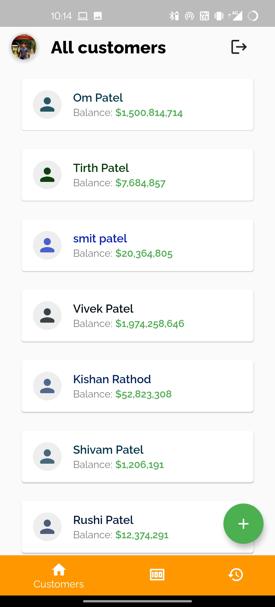
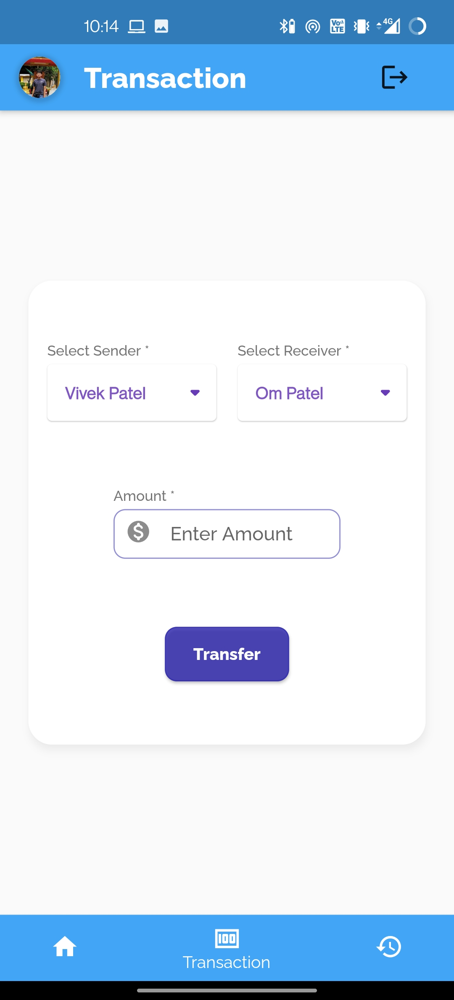
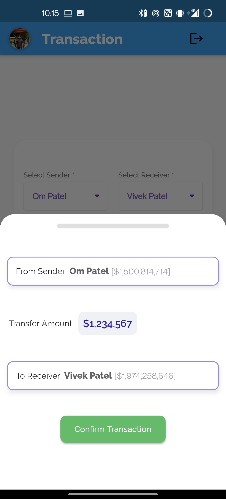

T
# *Basic Banking Flutter App*

A Flutter project integrating Firebase for secure transactions between users.

---

## *Table of Contents*
1. [About The Project](#about-the-project)
2. [Features](#features)
3. [Built With](#built-with)
4. [Demo](#demo)
5. [Contributing](#contributing)
6. [Contact](#contact)

---

## *About The Project*

This project is designed to demonstrate the integration of Flutter and Firebase for building mobile applications with real-time data synchronization and authentication. It allows users to perform transactions securely while maintaining a record of all activities.

---

### *Features*
- *Google Account Sign-In*: Secure authentication using Firebase Authentication.
- *Admin Privileges*: Add users to the database with admin-only access.
- *Customer Overview*: Display all customers along with their account balances.
- *Secure Transactions*: Transact amounts between customers and update balances in real-time.
- *Transaction History*: View detailed transaction history, including sender and receiver information.
- *Real-Time Data Updates*: Utilize Firebase Streams for dynamic data updates without screen refreshes.

---

### *Built With*
- [Flutter](https://flutter.dev/) - Cross-platform mobile app development framework.
- [Firebase Authentication](https://firebase.google.com/docs/auth) - Secure user authentication.
- [Firestore Database](https://firebase.google.com/docs/firestore) - Real-time NoSQL database for storing user and transaction data.

---

## *Demo*

Here are screenshots showcasing various screens of the application:

   

## *Contact*
